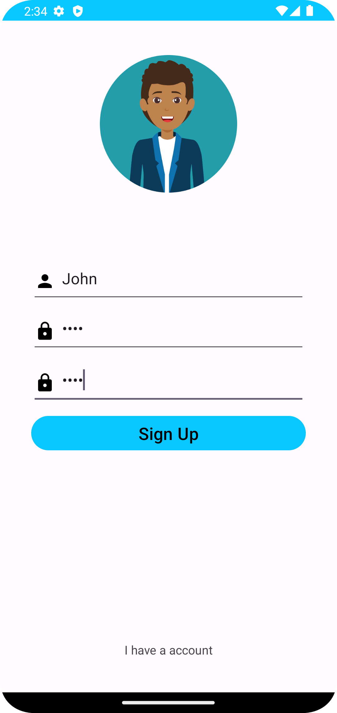

[Leia esta página em português](./README.md)

# Phone Book

## Introduction

Project to manage contacts, allowing numerous registered access users and contacts separated by users.

  
  
  
  
  
  

## Objective

Consolidate the content studied in native Android development with Kotlin.

## Features

- Perform login and registration
- View list of registered contacts
- View, add, edit, and delete contact
- View, add, edit, and delete access user
- Navigation through side menu

## Technologies Used

- Kotlin
- Android Studio

## Credits

The application was developed by me as a project to consolidate my knowledge in native Android with Kotlin.
