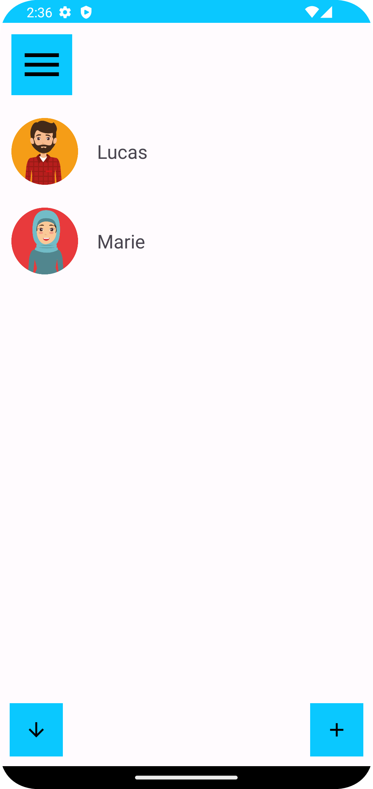
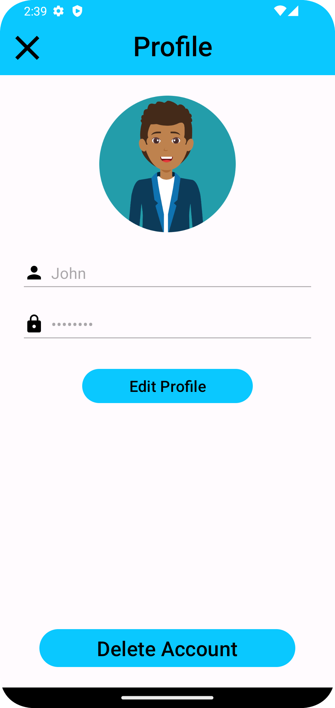

[Read this page in English](./README-en.md)

# Phone Book

## Introdução

Projeto para gerenciar contatos, podendo ter inúmeros usuários de acesso cadastrados e ter os contatos separados por usuários.

## Objetivo

Consolidar os conteúdos estudados no desenvolvimento de android nativo com kotlin.

## Funcionalidades

- Realizar login e cadastro
- Visualizar lista de contatos cadastrados
- Visualizar, adicionar, editar e deletar contato
- Visualizar, adicionar, editar e deletar usuário de acesso
- Navegação por menu lateral

## Tecnologias Utilizadas

- Kotlin
- Android Studio

## Créditos

O aplicativo foi desenvolvido por mim como um projeto para consolidar meu conhecimento em android nativo com kotlin
